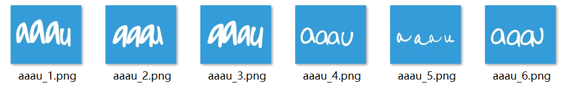

# CaptchaIdentifier
Image Captcha Solving Using TensorFlow and CNN Model，with self-labeling image Dataset，free to download my Dataset for  self-learning. accuracy 95%+.

&emsp;

Note:this implementation, in some way, is kind of  rough, but effective. hope to motivate your inspiration to do better work. 

# Description

- original Data

  * raw_img shape:100*120

  ​							

- preprocessed Data

  * preprocessed_img shape:100\*120*1

&emsp;&emsp;

- Network-structure

- accuracy

&emsp;&emsp;after training, the accuracy is 95%+, managing to identify complex captchas, as below:

# DataSet

&emsp;&emsp;Happy to contribute the dataSet, images are from a real website, labling by tired  eyes and numb hands, so if you think it can do some kind of help,  star it. Thank you! download the data by [Baidu Pan](https://pan.baidu.com/s/1iK3D0sDkbM6_u-LKpgs2Yg),

sharing code is: `oacx`，enjoy!

# contact

If any question, you can contact me: jeffery_cpu@163.cm

last-update:2019/01/06